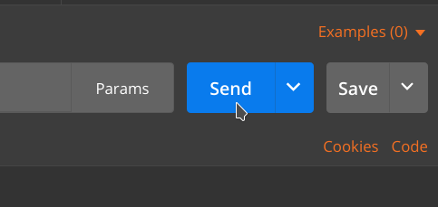
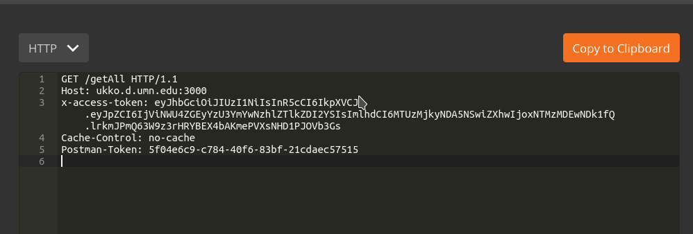
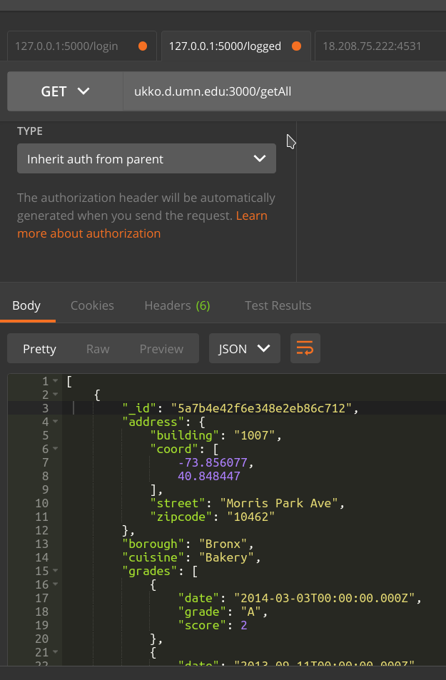

# Node and Mongo

This weeks lab will deal with linking both the Mongo database and Express application. We will build it in steps so that you can follow along till you have the basic template and then you can fill out the rest of the functionality yourself.

You can do this entire lab on your local machine if you have mongo server installed. Otherwise you just need to have a mongo server that you can connect to finish this lab (check instructions in the end of this document).

To install mongodb on your computer you can go here <https://www.mongodb.com/try/download/community>. Download the community server and do not install Mongodb Compass.

Note For Windows users:

You may need to edit the PATH variable in your system environment. The PATH environment variable allows your system to locate executables via the command line. You can follow the instructions at this link:

   + <https://codinglead.co/javascript/setting-environment-variables-in-windows-10>


## Quickstart

1. Clone the repo

2. Fill out mongod.conf and replace path with path to your directory!

   1. ```
      systemLog:
         destination: file
         path: "/PATH TO DIRECTORY/mongod.log"
         logAppend: true
      storage:
         dbPath : "/PATH TO DIRECTORY/mongo"
         journal:
            enabled: true
      net:
         bindIp: 0.0.0.0
         port: 12113
      setParameter:
         enableLocalhostAuthBypass: false
      
      ```

   2. ``pwd`` to find the path

   3. Replace the port with a new number

   4. Run ```mongod -f mongod.conf```

3. Using Robo3t or other mongo tool connect to your DB

   1. We will need to add some data to the collection inside our mongo server. To do this you can go to the RoboMongo database you have, create a new collection called “Restaurants” and you can add this test data into it <https://raw.githubusercontent.com/mongodb/docs-assets/primer-dataset/primer-dataset.json> add the collection name to the collection list below
   2. You only need 10 items!!! So do not worry about getting the whole data set!!!!

4. In new prompt run ```npm install``` this should install packages

   1. open myDb.js and replace out URL information of mongodb
      1. Also replace the LIST OF COLLECTIONS with the name of the collection containing the data you added in quotes
   2. open index.js and replace port numbers
   3. To start server run ```node index.js``` or ```nodejs index.js```


## Assignment

To receive points for this lab you will need to add to the code from the repository and implement the following queries and REST interactions:

1. A GET endpoint ‘/getall’
   1. Make this call a mongoDB function that responds with all documents in the Restaurant collection you imported and limit it to 10
2. A POST endpoint ‘/createCollection’
   1. Make this call a mongoDB function that will create a new collection with the supplied name.
   2. The required collection name  will come from the request.body

      1. ```req.body.name```

   3. This should return a status of 201 if valid otherwise 409
3. A POST endpoint ‘/getCollection’
   1. Make this call a mongoDB function that returns all documents in the specified collection limit to 10
   2. The required collection name will come from the request.body
   3. This should return the documents in the collection specified [limit 10]
4. A POST endpoint ‘/insertToCollection’
   1. Make this call a mongoDB function that will insert the object into the specified collection.
   2. The object will consist of 
      1. ```name : Name``` of collection

      2. ``` hash : Random value```

      3. other  //JSON object 

         Example:
         ```
         {
           "name": "test",
           "hash": "b73d24921dea5462a00357f25e9f92c2",
           "other": {
             "id1": "junk",
             "id2": "junk"
             }
         }
         ```

   3. The required object will come from the request.body

   4. Return the values inserted into the database


## Submission

For this lab, we will not require you to show us the program executing the test script. Instead we would like submissions via Canvas. 

Your submissions must include 4 things:

1.  A text file listing the requests you would make in POSTMAN or CURL to access the endpoints. Something of the format that POSTMAN allows you to view by selecting **Code** near the **Send** button.

       

       

   ```
   POST  HTTP/1.1
   Host: 18.208.75.222:4531
   Content-Type: application/json
   Cache-Control: no-cache
   Postman-Token: cc32bcce-e25f-4415-a6e7-9dfdb40bc8e2
   
   {
   	"id":"strau177",
   	"cont" : "Message"
   }
   ```

   Or if using **Curl**

   ```
   curl -d '{"data":"asdfasd"}' http://127.0.0.1:3001/todo/add -H "Content-Type:application/json"
   ```

   

2. The 3 other submissions will be screenshots that show the responses from your server. Either via the **terminal** if using **Curl** or the **Response** section if using **POSTMAN**

   Something similar to 

   

 
## Common Errors

### My mongodb doesn't hand and goes to a prompt

Look for the file called mongod.log. At the end of this file will be the error that is causing it not to run. 

### EADDRINUSE

This means the port number is not available. Retry with a different port number

### Node command not found

try running ```nodejs```

## Run test program

Note Included is a python test script. It will verify that your endpoints are working correctly. In order to run it make sure you have Mongo running and your Node server running as well. All you need to do to run it is execute : 

```python
python3.5 test.py -p <PORT> -n <NAME> -uid <USERNAME>
```

## MongoDB setup

- Login to ukko with your username

- - Note: You will need to ssh in via Putty, Linux command line, Cygwin, etc.

- Create the directory for your lab, you can name it whatever you want

- Since you will be running everything remotely you will need to create a local mongo instance. 

- - You will need to use a terminal multiplexer otherwise you will be locked out of running any commands. You can use either tmux or screen

  - Tmux and screen allow you to have multiple tabs open which allows you to have a service running in one of them, in this case it will be mongod

  - <http://man7.org/linux/man-pages/man1/tmux.1.html>

  - <https://ss64.com/bash/screen.html>

  - If using tmux

  - - Basic usage:

    - - Create Tab: \<ctrl-b\> + c

      - Switch Tab: \<ctrl-b\> + #

      - - Tabs have numbers to identify them at bottom of screen

      - Detach and leave tmux running: \<ctrl-b\> + d

      - Delete Tab: \<ctrl-b\> + x

- Since ukko has a mongo service running in the background we have to create a mongo configuration file to use.

- - <https://docs.mongodb.com/manual/reference/configuration-options/>
  - Create a file in the same directory titled mongod.conf

```mongo
systemLog:
   destination: file
   path: "./mongod.log"
   logAppend: true
storage:
   dbPath : "./mongo"
   journal:
      enabled: true
net:
   bindIp: 0.0.0.0
   port: 12113
setParameter:
   enableLocalhostAuthBypass: false

```

- **Now to start mongo run:** : ``` mongod --config mongod.conf ```

- - *** Create the mongo directory specified in your dbPath above *** 
  - Your terminal tab will be unresponsive but your database will be up and running

## How index.js was put together

- I have provided the basic template with the code below included within a GIT repository:

- - <https://github.umn.edu/CS4531/MongoRest>

- Make sure you run **npm install(** to install necessary packages

- The code inside index.js is thus:

 ```javascript
var express = require('express')
var mongojs = require('mongojs')
var app = express()
var db = require('./myDB.js')

app.use(express.json())
app.get('/', (req, res) => {console.log("HELLO");})
app.listen(3000, ()=>console.log("listening"));
 
 ```
- For now this is all we need. We will come back to this file after we setup Mongo now.

- **On ukko if you can’t run “node” on it’s own just supply the full path:**

  - ```/usr/bin/nodejs```
  - or add an alias in your bashrc
    - ``` alias node=/usr/bin/nodejs ```


Note: we will be using a keyword module.exports in the file that we create here. This is a way for us to assign values to be exported as modules. They can then be accessed by other files. Read up on it here: <http://www.tutorialsteacher.com/nodejs/nodejs-module-exports>

 

- Again the code has been provided for you within the myDB.js file. You will still need to setup the mongo server and the database in order to get this portion to work.

- We will need to add some data to the collection inside our mongo server. To do this you can go to the RoboMongo database you have, create a new collection called “Restaurants” and you can add this test data into it <https://raw.githubusercontent.com/mongodb/docs-assets/primer-dataset/primer-dataset.json> add the collection name to the collection list below

- In your file we will start it with:

 ```javascript
const mongojs = require('mongojs'); //imports 'mongojs'
const assert = require('assert'); //Assertion for queries

// Connection URL
const url = "mongodb://localhost:27017/YOURDBHERE"; 
//URL with database included for local mongo db

// Database Name
const collections=[ADD LIST OF COLLECTIONS HERE]; //list of collections that you will be accessing. 
mongodb = mongojs(url, collections);

module.exports = {
        
    printAllInCollection : function(collectionName, callback){
        var cursor = mongodb.collection(collectionName).find({}).limit(10, function(err, docs){

            if(err || !docs) {
                console.log("Cannot print database or database is empty\n");
            }
            else {
                //console.log(collectionName, docs);

                callback(docs);
            }
        });

    }
}
 ```


## How myDb.js is put together

Circling back around we can now import our database file into our main app,

- To import do: ```var db = require(‘./myDB.js’)()```

- The module.exports allows us to call the functions using ```db.<function name>```

- This is because of the way we exported the functions, if you noticed it was exported in a dictionary {} using the alias of printallcollection to the function

- So now in your index.js/app.js or whatever try this command in your app.get

 ```javascript
app.get('/getall', (req, res) => {db.printallcollection(“Restaurant”, function(items){
    console.log(items)
    res.send(items)
})})
 ```
